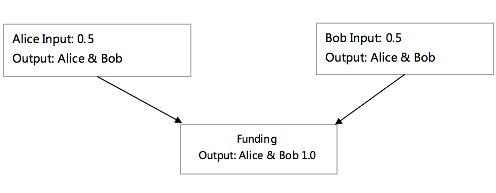
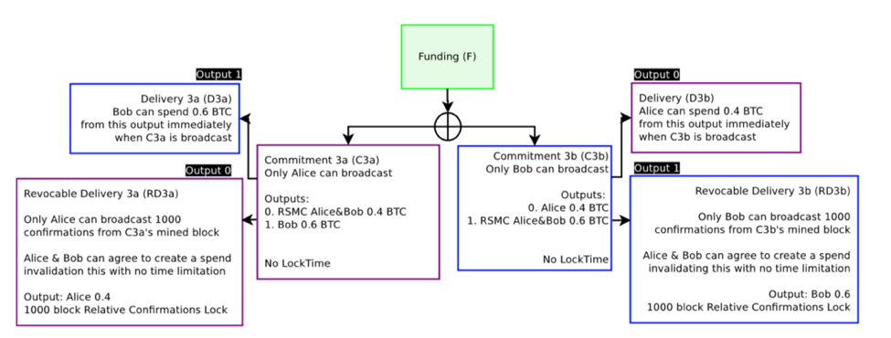

#                    **比特币闪电网络剖析**

比特币区块链是可信赖的全球分布式账本 。然而，作为一个支付平台，不久的将来它将无法承载全球贸易的交易需求 。VISA网络支付的峰值每秒可承载47000次交 易，比特币网络在每个区块1MB的限制下每秒交易不到7次。假设区块的大小不受限制且每笔交易的大小为300个字节，那么以每秒47000笔的交易计算，每十分钟生成的一个区块（比特币平均每十分钟产生一个区块）大小将达到8GB。交易数据的膨胀速度很快让计算机无法承受。

是否所有的交易都有必要被写入全局账本？比如Alice去Bob的便利店买了一瓶可乐或是Alice乘坐了一次出租车，这样琐碎的交易被写入全局账本的价值并不大。闪电网络提出了off-chain（链下的交易方式），双方的交易不会每次都写入全局账本，直到交易双方认为是时候将他们的账户状态同步到全局账本中。例如 ，Alice是一个普通的用户，Bob是Alice家附近便利商店的老板，Alice一年在Bob的便利店中可能发生100次的小额交易。使用闪电网络交易，只有两笔交易被写入全局账本，第一笔是他们之间建立双向通道的交易（后续详述）；第二笔是第100次交易完成后的账户状态。除了这两次交易，其余交易几乎都是链下瞬间完成，不会被写入全局账本

闪电网络为小额支付提供了性能（时间）上的保障，链下的p2p交易可以在全球同时发生，峰值承载交易能力将超越VISA网络；同时也保障了区块中的存储空间得以高效利用。

闪电网络的构建基于比特币的交易脚本，如果不熟悉比特币的交易脚本建议先阅读《精通比特币》中的交易章节。

###**双向交易通道**

双向交易通道顾名思义，是指交易双方都可以向对方发起支付的交易通道。交易通道的重点在不引入任何第三方的情况下，保障了交易双方可以在链下完成安全的交易。

为了保障后续的链下交易能有效的进行，交易双方需要建立一个Funding作为交易的保障。如图1所示：

​	

​                                                                      图1

交易输出的地址是Alice和Bob的联合多签地址，锁在这个这个多签的地址上的资金成为后续交易的基础，原论文中把这个交易称为Funding Transaction，意为双方共同出资建立了一个交易的通道。被锁在交易通道中的不一定是比特币，可以延申为有效的可交易的数字权证。

Alice和Bob直接签名将自己的资金锁到Funding 上会出现一个问题，当任意一方签名后如果对方作恶不签名，将导致已签名一方的资金被永远锁在Funding上无法赎回。为了解决这个问题在双方签名Funding之前，双方要签署承诺交易（commitment Transaction），承诺交易承诺双方都可以赎回在Funding中的资金。如图2所示。

​                                                                      图2

此时所有的交易都未被广播。承诺交易建立在一个还未存在的交易输出上，在原有的比特币交易中Commitment Transaction无法被签署，因为在比特币中起草交易需要填写父交易的Transaction ID,交易输入的签名是Transaction ID 的一部分。闪电网络实现SIGHASH\_NOINPUT交易，使得一个未签名的2-2交易的输出可以被子交易所用。在签署了Commitment Transaction之后，交易双方能安全赎回各自在Funding中的资金，因为双方已在2-2地址上签名承诺对方可以取回相应的资金。在确定自己的资金可以被安全赎回，双方签署父交易Funding Transaction，并将Funding Transaction广播，等待其被写入区块链之后通道建立完成。Funding 的建立相当于双方各自交出保证金以保障后续交易。

###**可以被撤销的承诺交易**

在Funding被写入区块链后交易的状态如图3所示。绿色部分表示已经被写入区块链，Commitment Transaction可以将双方在Funding中的资金赎回。

{width="6.5in" height="3.4541666666666666in"}

​                                                                     图3

{width="6.5in" height="2.8472222222222223in"}

​                                                                       图4

当一个新的交易发生后，如图4所示，出现了一个问题，此时有两个合法的Commitment Transaction 可以被广播，新的交易更新了Funding中资金分配的方案Alice在新的交易中可以赎回0.4BTC，Bob赎回0.6BTC。而之前的交易中Alice可以赎回0.5BTC，Bob赎回0.5BTC。Alice就有了做恶的动机，Alice广播之前的交易能赎回更多的资金。任何一个Commitment Transaction 广播以后交易通道即被关闭，通道中的资金被锁到各自的账户中，所以一旦Alice提交了旧版的交易，Bob将无法挽回损失。所以off-chain的交易只有最新的交易是合法的，广播之前的任何交易被视为违约操作。

要防止交易双方广播旧版本的Commitment Transaction，需要解决两个问题，第一，鉴别交易双方中是谁违约提交了旧版本的交易，第二，当一方广播Commitment Transaction之后必须有公示时间，在公示时间内另一方可以提出申诉。

{width="6.5in" height="3.0381944444444446in"}

​                                                                      图5

如图5所示解决了第一个问题，图5和图3表示的是同一个交易，都表示了为建立交易通道而建立的承诺交易，在这个交易中Alice和Bob都可以在通道中赎回0.5BTC，差别在于图5中的Commitment Transaction双方有了属于自己的版本，紫色的代表Alice的版本，已被Bob签名，Alice可以广播；蓝色是属于Bob的版本，已被Alice签名，Bob可以广播。双方各自的版本对应了不同的Transaction ID，ID将被用于鉴别是谁广播交易。

如图6解决了第二个问题，图6和图5的差别在于，在Alice可以广播的交易C1a中的output0添加了RSMC（Revocable Sequence Maturity Contract ），RSMC应用了在比特币交易中，一个交易可以被设定等待特定数量的新区块写入区块链后该交易才生效，这就是公示时间，而在这个等待时间里可以由新的交易将这个交易取代。同样在Bob可以广播的交易C1b中，第1个输出加上了RSMC的限制条件。也就是说，无论谁广播了自己的手中的交易，交易的另一方可以立即获取交易中的属于他的资金，而广播交易的一方必须等待1000个新的区块产生后产能拿到属于他的资金。

{width="6.5in" height="4.664583333333334in"}

​                                                                   图 6

图7表示了Bob提交了一个合法的交易，图中只有一个版本的交易所有它肯定是合法的。绿色表示已写入区块链的部分，当Bob广播C1b后C1b,D1b都被写入区块链。而RD1b将等待1000个区块后才被认定有效，才会被写入区块链。

图8 所示等待1000个区块以后RD1b也被写入了区块链。

{width="6.05625in" height="3.875in"}

​                                                                     图7

{width="5.80625in" height="4.166666666666667in"}

​                                                                      图8

现在的状态可以鉴定每一个Commitment Transaction是由谁广播的，并且广播的一方还需等待一个公示的时间，在这个公示的时间里，如果交易的对立方发现广播的一方违约广播了之前的交易，他可以提出申诉。在闪电网络中对违约方的惩罚是将交易通道中所有的资金输出给被违约的一方。

{width="6.5in" height="3.357638888888889in"}

​                                                                     图9

新的交易C2a，C2b被建立时，如图9所示，有四个合法的Commitment Transaction，它们都能被广播。此时必须使C1a,C1b无效，因为只有最新的交易才能有效的表达双方最新的账户状态。当C1a被Alice违约广播，C1a中属于Alice的输出0会被转给Bob；当C1b被Bob违约广播，C1b中属于Bob的输出1会被转给Alice。即在C2已经建立以后，任意一方违约广播了C1中的交易在C1中的属于他的资金会被输出给对立方。为了达到这样的效果，双方在建立C2交易的时候需要签署额外的Breach Remedy Transactions ，BR1a, BR1b来约束C1a/C1b的违约，如图10所示。

Alice需要签署BR1a并交给Bob，此时BR1a有效当且仅当C1a被广播，可以通过C1a的Transaction ID来标识C1a。Bob需要签署BR1b并交给Alice，此时BR1b有效当且仅当C1b被广播。当BR1a生效，Bob在C1a的公示时间内将其广播Alice将损失通道中所有的资金，当BR1b生效，Alice在C1b的公示时间内将其广播Bob将损失通道中所有的资金。

有了这样的保障机制交易双方都会有足够的动机将之前所有的Commitment Transaction 删除，因为一旦之前的交易被错误的广播，自己将损失通道中所有的资金。

在这里还有一个问题，当一个新的交易被创建的时候，有四个交易需要被签署，交易双方各签两个，Alice 要签C2b和BR1a，Bob要签C1a和BR1b。这四个交易以什么样的时序进行签署？这里的时序可以有很多种组合，一个设计不当的组合会让先签署的一方蒙受损失，比如在图10中，Bob先签署C2a和BR1b，那此时Bob将没有可被广播的交易，而Alice此时违约拒绝签署任何交易，Alice拥有两个可以被广播的交易C1a，C2a，Alice可以选择一个对她有利的交易广播，在这里是C1a。如果发生这样的情况Bob将损失0.1BTC。签署时序的问题并没有在原始论文中被提出，当在阅读的时候一致被这个问题困扰。想出来的一个方案：在新的交易中资金减少的一方必须先完成C和BR的签名，因为获得更多资金的一方应该没有太多的动机违约，当然也不排除获得更多资金的一方毁约的情况，他就很单纯的不想交易了。如果要完成杜绝这样的违约发生，可能需要钱包之间能承载分布式原子交易。还有更好的办法吗？

{width="6.5in" height="3.752083333333333in"}

​                                                                    图10

如果交易双方是友好的结束他们之间的交易通道，可以通过建立一个Exercise Settlement Transaction ，交易双方都可以将ES广播，ES进入区块链后双方都能拿到自己的资金，而没有任何一个方需要等待1000个新的区块产生。如图11所示。

{width="6.5in" height="3.3569444444444443in"}

​                                                                    图11

至此，通过解决两个问题，第一，谁违约？第二，发起广播的一方需要一个公示的等待时间。可以安全的完成两两之间的off-chain交易。

###**Hashed Timelock Contrat （HTLC）**

之前只讨论了两个交易者之间的情形，两个交易者可以off-chain交易的前提是在他们之间建立交易通道，这样的约束限制了交易灵活性。比如到了一个新的城市，在乘坐出租车的时候必须和这个出租车公司建立一个交易通道，但是在这个城市只停留一天只会乘坐1次出租车，所以并不想去建立这个交易通道，一是麻烦，二是Funding Transaction 是一个上链的操作，需要支付矿工费，有可能建立Funding Transaction的矿工费用比乘坐出租车的费用还贵。

解决这个问题的方法是可以通过从已建立的通道中寻找一条可能的路径来支付出租车的费用。每一个钱包是一个点，每一个已经建立的Funding Transaction在点和点之间建立了一条边，形成图，在这个图中搜索可能的路径完成支付。

Alice需要向Bob支付0.1BTC，这个交易的条件是如果Bob能在规定的时间内（比如三天内）向Alice提供一个原语（一个字符串），这个原语被Hash之后和Alice将自己原语hash后的结果做对比，如果相等则认证成功，Alice向Bob支付0.1BTC。如果三天之内Bob没能向Alice提供正确的原语，Alice收回0.1BTC。

通过使用一个原语在图中建立的支付路径上传递，那么交易的资金也就能在这条路径上进行传递并最终完成支付。构建这条支付路径的基础组建是HTLC，构建它也需要两点，第一，需要原语和hash，第二，需要一个timeout机制。下面就来讨论HTLC的构建。

{width="6.5in" height="3.5236111111111112in"}

​                                                                      图11

图11是一个非常简单的构造，这个构造在Commitment Transaction中添加了一个HTLC，这个HTLC有两个输出，一个是直接向Bob支付0.1BTC，条件是Bob能在三天之内提供原语R；另一个是三天之后Bob还没有提供原语R，Alice 收回0.1BTC。

这个简单的结构有一个问题，就是一年（或者一个比三天大的时间）以后当这个旧的Commitment Transaction被提交以后，这个HTLC的两个输出都是有效的，一年后Bob知道了原语R并广播这个过时的Commitment Transaction依然可以提取现金，只要HTLC输出给她的资金对他有足够的诱惑，因为只要能提供原语这个交易的条件就满足了。所以在约定的时间到期以后Alice关闭这个交易是非常必要的。 Alice就必须在三天以后将这个交易广播，以将其关闭。这并不是所期望的，因为想要的是off-chain的交易。

要想在off-chain的状态下完成关闭HTLC的操作，需要在HTLC中嵌入之前讨论的RSMC。类似之前讨论的双向交易通道，在RSMC的等待时间中使用Breach Remedy Transaction 对违约提交过时的交易进行惩罚约束。

{width="6.5in" height="5.596527777777778in"}

​                                                                      图12

假设Alice和Bob他们之间要建立一笔新的交易如图12所示，交易通道之前的状态是Alice和Bob各0.5BTC。在新的交易中Alice通过HTLC支付0.1 BTC给Bob。新的Commitment Transaction有三个输出，第0个输出和第1个输出把资金分别输出给Alice和Bob，Bob可以立即拿到0.5BTC，Alice只能拿到0.4BTC因为要扣除0.1BTC给HTLC输出。这两笔交易和之前的双向交易通道一样，谁广播的Commitment Transaction交易谁的资金就需要等待一个公示时间才能赎回，交易的另一方的资金需可以立即被赎回。第3个输出是一个HTLC，这个输出根据不同的条件会有两种不同的输出情况。在图12将这个交易的可能发生的情况都已经展开，这些交易中广播方资金的输出嵌入了RSMC，在新的交易被创建的时候参照双向交易的通道中对Revocable Delivery交易使用Breach Remedy Transaction进行约束，就能对违约广播旧版的Commitment Transaction进行惩罚。一个完整的视图如图13所示。

{width="6.5in" height="7.1875in"}

​                                                                   图13

如图13所示，C2a/C2b一共有8组公私钥。

在Alice所持有的C2a中HTLC的输出脚本HED1a需要PAlice2，PBob2，这个脚本被原语R锁住；还有一个脚本HT1a需要PAlice1和PBob1，在此时Alice已经拥有了HT1a中所需要的秘钥（在建立C2a/C2b时使无效了C1a/C1b所以Alice已经拥有了PAlice1和PBob1的秘钥）。

在Bob所持有的C2a中HTLC的输出脚本HE1b中需要PAlice6和PBob6，这个脚本被原语R锁住；还有一个脚本HED1b被PAlice5和PBob5，此时Alice拥有了解锁这个脚本的秘钥，Bob已将PBob5的秘钥交给Alice。

从Alice的视角来看，当Alice广播C2a，第0个输出是直接给Alice的0.4BTC，这个输出是一个RSMC，需要有一个公示的时间Alice才能赎回这笔资金。第1个输出是给Bob的0.5BTC，Bob可以立即获得这笔资金。第3个输出是一个HTLC，它有两种输出的可能，若Bob可以在三天内提供原语R，Bob可以立即拿到0.1BTC。HT1a只能被Alice在3天之后提交，HT1a是一个RMSC输出，这个输出构建了HTRD1a，HTRD1a需要等待1000个新的区块进产生以后才能被视为有效，是一个可以被撤回的交易，当C2a被Alice违约的广播，Bob可以通过BR2a，HBR1a，HTBR1a将交易通道中的所有资金赎回，Alice损失掉自己所有的资金。

从Bob的视角，当Bob广播了C2b，第0个输出是直接把0.4个BTC给Alice，第1个输出把0.5的BTC给Bob这是一个RSMC。第三个输出是HTLC，HTLC根据状态有两个可能的输出。一个是HE1b，当Bob获取正确的原语后将其广播在公示时间后Bob可以获取这笔资金。如果在三天内Bob没有获取有效的原语，Alice可以广播HTD1b并立即赎回0.1BTC。当C2b被Bob违约广播，Alice可以通过BR2b，HBR1b，HTBR1b赎回交易通道的所有资金，Bob损失掉自己的所有资金。

{width="6.5in" height="2.4680555555555554in"}

​                                                                      图14

当C2中的HTLC的输出都已经清晰以后，交易双发建立新的C3如图14所示，交易通道的一个新的状态。C3是交易双方新的共识，C2被彻底的摒弃。

###**闪电网络**

在RSMC和HTLC基础之上就可以将点连成网络，寻找可能的支付路径。如图15 所示：

{width="6.5in" height="1.5993055555555555in"}

​							         图15

Alice想要向Dave支付一笔小额费用，但是Alice和Dave之间并没有建立交易的通道，Alice和Bob有一个交易通道，Bob和Carol有一个交易通道，Carol和Dave有一个交易通道。那就可以使用HTLC建立一个上图所示的交易路径，在这条路径上交易的锁定时间是递减的。Alice 把一个字符串原语给Dave，Dave把原语交给Carol做验证并从Carol得到的资金，Carol会把原语穿给Bob做验证并从Bob拿到金额，Bob把原语传递给Alice做验证并从Alice拿到金额，完成支付的传递。因为支付路径上的HTLC的锁定时间是递减的，所以路径上的每一个参与者都会有足够的时间去赎回自己的BTC。

在交易的路径上还会有很多意外可能发生，在这里不展开。
